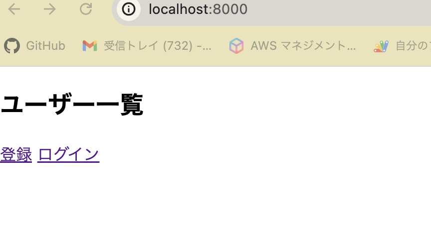

# 手作りブログ

``````
docker compose build
``````

```
docker compose up -d
```

```
docker exec -it blog_backend bash
```

#### 初回の場合migrateコマンドを実行
```
python manage.py migrate
```


```
python manage.py runserver 0.0.0.0:8000
```

### localhost:8000にアクセス
